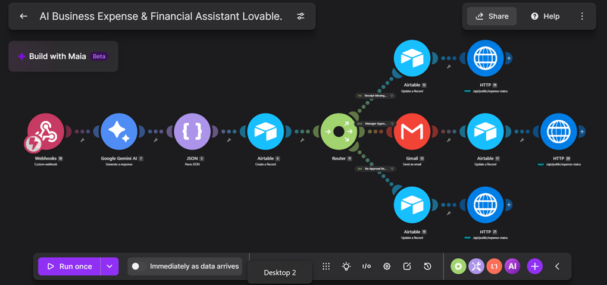
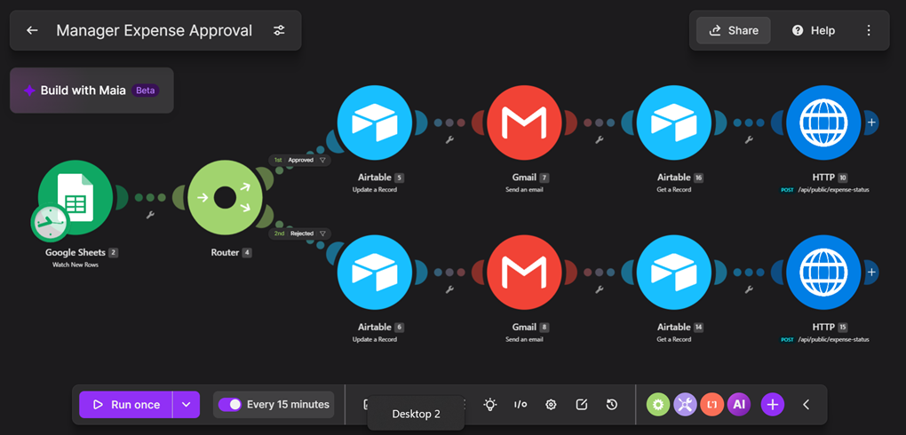
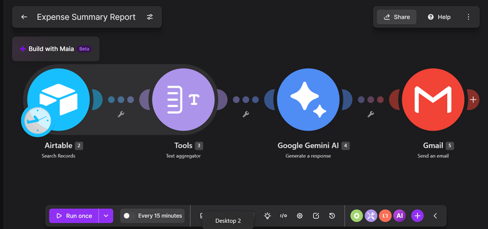

# AI Business Expense & Financial Document Assistant

## Project Overview
Developed an AI-powered expense management solution integrating Lovable, Make, Gemini AI, Airtable, Gmail, webhooks, and APIs to streamline financial operations.

## Project Objectives
- Automate employee expense submissions and categorization.
- Reduce manual expense processing and approval delays.
- Improve expense tracking, transparency, and reporting.

## Key Features
- AI-assisted expense categorization
- Receipt validation and clarification routing
- Automated approval routing based on expense thresholds
- Manager approval and rejection workflows
- Real-time expense tracking dashboard
- Automated email notifications and financial reporting

## Tools Used
Lovable | Make | Gemini AI | Airtable | Google Forms | Google Sheets | Gmail | Webhooks | APIs

## Business Value
Improves financial process efficiency, reduces repetitive administrative work, and provides better visibility into expense submissions and approval decisions.

## Skills Demonstrated
AI Automation | Workflow Design | API Integration | Financial Operations | Data Management | Business Process Improvement

## 📁 Project Evidence & Documentation

The following screenshots and documentation demonstrate the end-to-end AI-powered expense management solution, including expense processing, approval routing, reporting, and dashboard visualization.

### 1. AI Expense Automation Workflow

This Make workflow integrates webhooks, Gemini AI, Airtable, routers, Gmail, and HTTP modules to process expense submissions and update expense statuses.

### 2. Manager Expense Approval Workflow

This workflow processes manager approval and rejection decisions, updates Airtable records, sends email notifications, and synchronizes expense statuses with the application.

### 3. Automated Expense Summary Report

This workflow retrieves expense records from Airtable, aggregates the information, uses Gemini AI to generate a summary, and sends the report through Gmail.

### 4. Finance Dashboard

The Lovable finance dashboard displays total submitted expenses, approval statuses, recent submissions, and departmental spending.

### 5. Project Report

📄 [View AI Business Expense & Financial Assistant Project Report](AI_Business_Expense_Financial_Assistant_Report_chioma_igbo.pdf)

The report provides additional documentation of the project, including its business problem, solution design, implementation, and outcomes.

---

**Core Technologies:** Make | Gemini AI | Airtable | Lovable | Google Sheets | Gmail | Webhooks | APIs

**Skills Demonstrated:** AI Automation | Workflow Design | Systems Integration | Financial Operations | Reporting | Business Process Improvement
  

The solution demonstrates practical skills in AI automation, business process improvement, systems integration, and financial operations.
